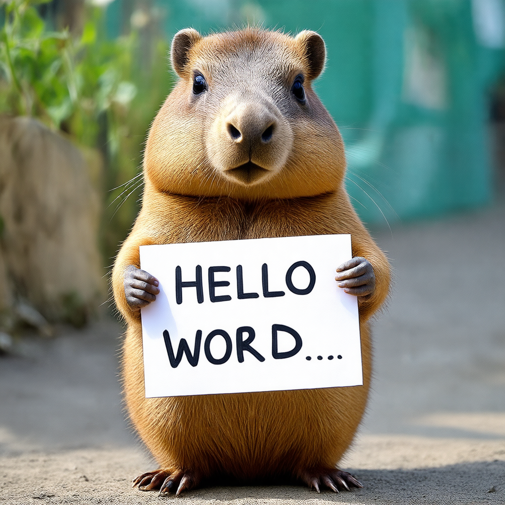
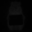

# Cross Attention Map Visualization

[](https://huggingface.co/spaces/We-Want-GPU/diffusers-cross-attention-map-SDXL-t2i)

Thanks to HuggingFace [Diffusers](https://github.com/huggingface/diffusers) team for the GPU sponsorship!

This repository is for extracting and visualizing cross attention maps, compatible with the latest [Diffusers](https://github.com/huggingface/diffusers) code (`v0.32.0`).

For errors reports or feature requests, feel free to raise an issue.

## Update Log.
[2024-12-17] Refactor and add setup.py

[2024-11-12] _Stable Diffusion 3_ is compatible and supports _batch operations_! (Flux and Stable Diffusion 3.5 is not compatible yet.)

[2024-07-04] Added features for _saving attention maps based on timesteps and layers_.


## Compatible models.
<!-- Compatible with various models, including both UNet/DiT based models listed below. -->
Compatible with various models listed below.
- [stabilityai/stable-diffusion-3-medium-diffusers](https://huggingface.co/stabilityai/stable-diffusion-3-medium-diffusers)
- [stable-diffusion-xl-base-1.0](https://huggingface.co/stabilityai/stable-diffusion-xl-base-1.0)
- [stable-diffusion-2-1-base](https://huggingface.co/stabilityai/stable-diffusion-2-1-base)
- ...

<!-- - [sdxl-turbo](https://huggingface.co/stabilityai/sdxl-turbo) -->
<!-- - [black-forest-labs/FLUX.1-dev](https://huggingface.co/black-forest-labs/FLUX.1-dev) -->


## Example.


<div style="text-align: center;">
    
    .png" alt="Image 2" width="400" height="400">
</div>


<details>
<summary>cap-</summary>
<div markdown="1">

<div style="text-align: center;">
    
    
</div>

</div>
</details>


<details>
<summary>-y-</summary>
<div markdown="1">

<div style="text-align: center;">
    
    
</div>

</div>
</details>


<details>
<summary>-bara</summary>
<div markdown="1">

<div style="text-align: center;">
    
    .png" alt="-bara>" width="400" height="400">
</div>

</div>
</details>


<details>
<summary>hello</summary>
<div markdown="1">

<div style="text-align: center;">
    
    .png" alt="<hello>" width="400" height="400">
</div>

</div>
</details>


<details>
<summary>world</summary>
<div markdown="1">

<div style="text-align: center;">
    
    .png" alt="<world>>" width="400" height="400">
</div>

</div>
</details>


## demo
```bash
pip install -e .
pip install -r requirements.txt
```

### Stable Diffusion 3.0
```python
import torch
from diffusers import StableDiffusion3Pipeline
from attention_map_diffusers import (
    attn_maps,
    init_pipeline,
    save_attention_maps
)


pipe = StableDiffusion3Pipeline.from_pretrained(
    "stabilityai/stable-diffusion-3-medium-diffusers",
    torch_dtype=torch.bfloat16
)
pipe = pipe.to("cuda")

##### 1. Replace modules and Register hook #####
pipe = init_pipeline(pipe)
################################################

# recommend not using batch operations for sd3, as cpu memory could be exceeded.
prompts = [
    # "A photo of a puppy wearing a hat.",
    "A capybara holding a sign that reads Hello World.",
]

images = pipe(
    prompts,
    num_inference_steps=15,
    guidance_scale=4.5,
).images

for batch, image in enumerate(images):
    image.save(f'{batch}-sd3.png')

##### 2. Process and Save attention map #####
save_attention_maps(attn_maps, pipe.tokenizer, prompts, base_dir='attn_maps', unconditional=True)
#############################################
```

### Stable Diffusion XL
```python
import torch
from diffusers import DiffusionPipeline
from attention_map_diffusers import (
    attn_maps,
    init_pipeline,
    save_attention_maps
)


pipe = DiffusionPipeline.from_pretrained(
    "stabilityai/stable-diffusion-xl-base-1.0",
    torch_dtype=torch.float16,
)
pipe = pipe.to("cuda")

##### 1. Replace modules and Register hook #####
pipe = init_pipeline(pipe)
################################################

prompts = [
    "A photo of a puppy wearing a hat.",
    "A capybara holding a sign that reads Hello World.",
]

images = pipe(
    prompts,
    num_inference_steps=15,
).images

for batch, image in enumerate(images):
    image.save(f'{batch}-sdxl.png')

##### 2. Process and Save attention map #####
save_attention_maps(attn_maps, pipe.tokenizer, prompts, base_dir='attn_maps', unconditional=True)
#############################################
```

### Stable Diffusion 2.1
```python
import torch
from diffusers import DiffusionPipeline
from attention_map_diffusers import (
    attn_maps,
    init_pipeline,
    save_attention_maps
)


pipe = DiffusionPipeline.from_pretrained(
    "stabilityai/stable-diffusion-2-1",
    torch_dtype=torch.float16,
)
pipe = pipe.to("cuda")

##### 1. Replace modules and Register hook #####
pipe = init_pipeline(pipe)
################################################

prompts = [
    "A photo of a puppy wearing a hat.",
    "A capybara holding a sign that reads Hello World.",
]

images = pipe(
    prompts,
    num_inference_steps=15,
).images

for batch, image in enumerate(images):
    image.save(f'{batch}-sd2-1.png')

##### 2. Process and Save attention map #####
save_attention_maps(attn_maps, pipe.tokenizer, prompts, base_dir='attn_maps', unconditional=True)
#############################################

```