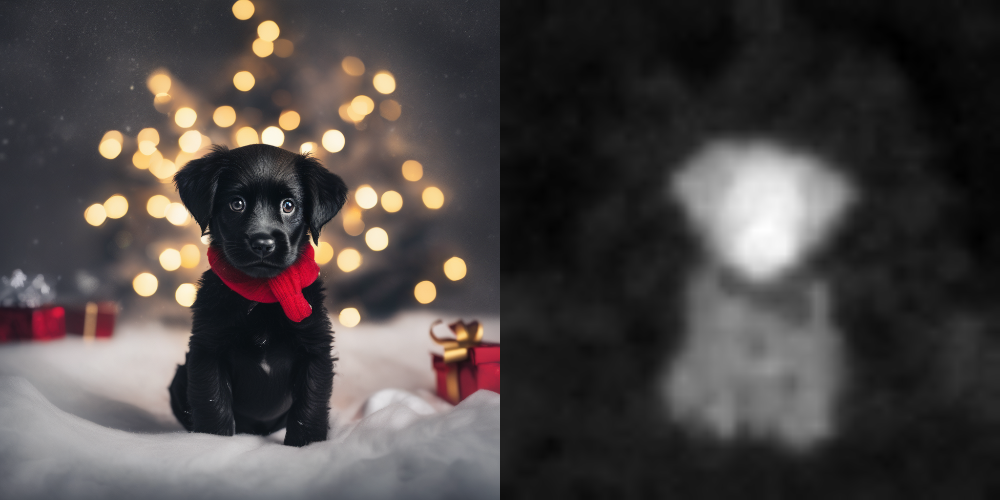
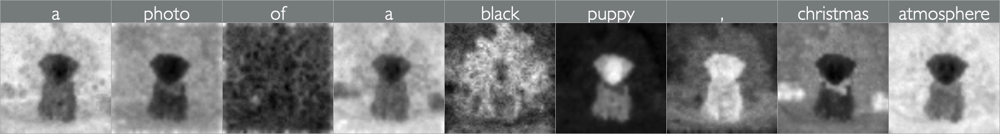
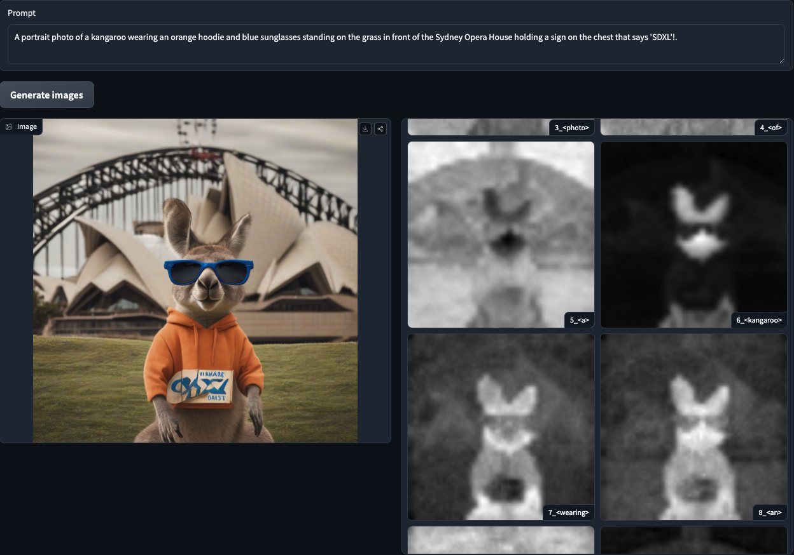

# Cross Attention Map

[](https://huggingface.co/spaces/We-Want-GPU/diffusers-cross-attention-map-SDXL-t2i)

Thanks to HuggingFace Diffusers team for the GPU sponsorship!

This repository is for extracting and visualizing attention maps, compatible with the latest Diffusers code (`v0.29.0`).

For errors reports or feature requests, please raise an issue :)

## Update Log
- [2024-07-04] 🎉 (_Latest update_) Added features for saving attention maps based on timesteps and paths, and refactored the code. 🎉


## Compatible models
UNet with attn2(cross attention module) is compatible
- [stable-diffusion-2-1-base](https://huggingface.co/stabilityai/stable-diffusion-2-1-base)
- [stable-diffusion-xl-base-1.0](https://huggingface.co/stabilityai/stable-diffusion-xl-base-1.0)
- [sdxl-turbo](https://huggingface.co/stabilityai/sdxl-turbo)
- ...


## Examples

<!-- 
 -->


<details>
<summary>6_kangaroo</summary>
<div markdown="1">

.png" alt="6_kangaroo">

</div>
</details>


<details>
<summary>10_hoodie</summary>
<div markdown="1">

.png" alt="10_hoodie">

</div>
</details>


<details>
<summary>13_sunglasses</summary>
<div markdown="1">

.png" alt="13_sunglasses">

</div>
</details>


## Initialize
```shell
python -m venv .venv
source .venv/bin/activate
# or
conda create -n attn python=3.9 -y
conda activate attn

pip install -r requirements.txt
```

## Visualize
Visualize Cross Attention Map for Text-to-Image
```shell
python t2i.py
```

## How to use
There are two methods for saving the attention map.: `save_by_timesteps_and_path` or `save_by_timesteps`(more intuitive.)
```python
import torch
from diffusers import DiffusionPipeline
from utils import (
    attn_maps,
    cross_attn_init,
    register_cross_attention_hook,
    set_layer_with_name_and_path,
    save_by_timesteps_and_path,
    save_by_timesteps
)

##### 1. Init modules #####
cross_attn_init()
###########################

pipe = DiffusionPipeline.from_pretrained(
    "stabilityai/stable-diffusion-xl-base-1.0",
    torch_dtype=torch.float16,
)
pipe = pipe.to("cuda:0")

##### 2. Replace modules and Register hook #####
pipe.unet = set_layer_with_name_and_path(pipe.unet)
pipe.unet = register_cross_attention_hook(pipe.unet)
################################################

height = 512
width = 768
prompt = "A portrait photo of a kangaroo wearing an orange hoodie and blue sunglasses standing on the grass in front of the Sydney Opera House holding a sign on the chest that says 'SDXL'!."

image = pipe(
    prompt,
    height=height,
    width=width,
    num_inference_steps=15,
).images[0]
image.save('test.png')

##### 3. Process and Save attention map #####
print('resizing and saving ...')

##### 3-1. save by timesteps and path (2~3 minutes) #####
save_by_timesteps_and_path(pipe.tokenizer, prompt, height, width)
#########################################################

##### 3-2. save by timesteps (1~2 minutes) #####
# save_by_timesteps(pipe.tokenizer, prompt, height, width)
################################################
```

## TODO
1. Applications(prompt-to-prompt, ...)
