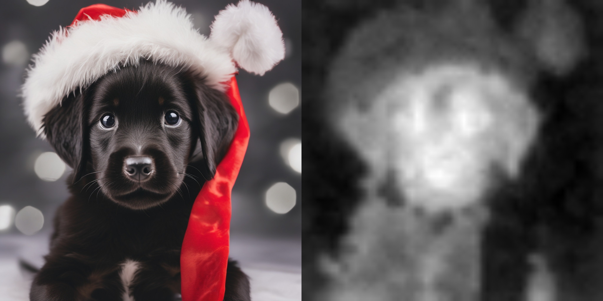

# Cross Attention Map
## Examples




## Initialize
```shell
python -m venv .venv
source .venv/bin/activate
pip install -r requirements.txt
```

## Visualization
Visualize Cross Attention Map for Text-to-Image
```shell
python t2i.py
```

## How to use
```python
import torch
from diffusers import StableDiffusionXLPipeline
from utils import (
    cross_attn_init,
    register_cross_attention_hook,
    attn_maps,
    get_net_attn_map,
    resize_net_attn_map,
    save_net_attn_map,
)

cross_attn_init()

pipe = StableDiffusionXLPipeline.from_pretrained(
    "stabilityai/stable-diffusion-xl-base-1.0",
    torch_dtype=torch.float16,
)
pipe.unet = register_cross_attention_hook(pipe.unet)
pipe = pipe.to("cuda")

prompt = "A photo of a black puppy putting on a santa hat"
image = pipe(prompt).images[0]
image.save('t2i_image.png')

dir_name = "attn_maps"
net_attn_maps = get_net_attn_map()
net_attn_maps = resize_net_attn_map(net_attn_maps, image.size)
save_net_attn_map(net_attn_maps, dir_name, pipe.tokenizer, prompt)
```